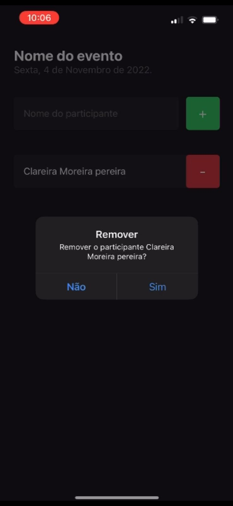

<h1 align="center"> Aplicativo ReactNative </h1>

Aplicativo desenvolvido para adicionar integrantes a um evento.  

  <a href="#-tecnologias">Tecnologias</a>&nbsp;&nbsp;&nbsp;|&nbsp;&nbsp;&nbsp;
  <a href="#-projeto">Projeto</a>&nbsp;&nbsp;&nbsp;|&nbsp;&nbsp;&nbsp;
  <a href="#memo-licença">Licença</a>

  

 

  
  

## 🚀 Tecnologias

Esse projeto foi desenvolvido com as seguintes tecnologias:

- ReactNative
- JavaScript
- TypeScript
- NodeJS

## 💻 Projeto

O Aplicativo é utilizado para adicionar lista de integrantes a um evento.

## :memo: Licença

Esse projeto está sob a licença MIT.
